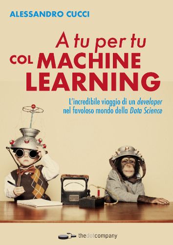

# A tu per tu col Machine Learning 
## L’incredibile viaggio di un *developer* nel favoloso mondo della *Data Science*

[]()

 

In questo repository troverete tutto il codice, l'indice e l'*errata corrige*
del mio libro "A tu per tu col Machine Learning", pubblicato da [thedotcompany](http://www.thedotcompany.it/).


## Installazione

Il libro contiene codice eseguibile con un interprete Python 3.

Il mio consiglio, per seguire al meglio i vari capitoli del libro e imparare il più possibile, è quello di scaricare il codice contenuto
in questo repository Git, eseguire il relativo notebook mentre si legge il capitolo, e provare di tanto in
tanto a modificare il codice.

Per eseguire il codice avrete bisogno di una macchina con Git installato ([https://git-scm.com/](https://git-scm.com/)),
e un interprete Python 3 (scaricate [Anaconda](https://www.anaconda.com/download/), che ha tutto quello che vi serve per non impazzire nell'installazione dei vari moduli aggiuntivi).

Una volta che avrete installato Git e Anaconda, scaricate il codice usando:
```sh
$ git clone https://github.com/alessandrocucci/ml-book.git
$ cd ml-book
$ conda install numpy pandas matplotlib tensorflow jupyter ipython scikit-learn
$ pip install tflearn
```

Installati i pacchetti necessari, avviate Jupyter per iniziare a lavorare:
```sh
$ jupyter notebook
```

## I capitoli del libro
### Parte I: Gli strumenti del Data Scientist
- Capitolo 1: Nuovo lavoro, nuovo linguaggio

    Questo capitolo è una brevissima guida alla programmazione in Python.
L’obiettivo non è fornire una guida di riferimento al linguaggio, quanto
piuttosto introdurre ai lettori che hanno un minimo di esperienza di programmazione, 
magari in altri linguaggi, questo linguaggio di programmazione oggi ai 
vertici nel mondo dei Big Data e del Machine Learning.

- Capitolo 2: Gestione dei Dati: iPython, Numpy e Pandas

    In questo capitolo vengono introdotte le librerie Python con cui un data
scientist lavora quotidianamente. iPython, affiancato dai notebook di Jupiter, 
danno una marcia in più alla console Python e permettono, oltre a salvare 
le sessioni di lavoro, anche di aggiungere facilmente testo e grafici al codice 
e alle elaborazioni dei modelli, permettendo anche di esportare il
lavoro svolto nei formati più disparati.

- Capitolo 3: Rappresentazione grafica dei dati

    Questo capitolo ha lo scopo di semplificarvi la vita. Osservare dati attraverso 
    grafici piuttosto che nella loro forma cruda ci permette di comprenderli
meglio, analizzarne la forma e decidere con cognizione di causa il tipo di
modello che meglio si adatta alla loro struttura. 

### Parte II: Apprendimento Automatico Supervisionato
- Capitolo 4: La migliore offerta: Regressione Multivariata

    Qui inizia la carrellata degli algoritmi di Machine Learning facenti parte
della branca dell’Apprendimento Supervisionato. Come prima avventura,
aiuterò un responsabile delle Risorse Umane a stimare il RAL da proporre
a un candidato basandosi sugli stipendi erogati attualmente in azienda, il
livello di istruzione, gli anni di esperienza, il ruolo e il linguaggio di 
programmazione con cui lavorerà. Per farlo, userò quello che viene chiamato
Regressione Lineare Multivariata.

- Capitolo 5: Prestiti e alberi decisionali

    Dalle Risorse Umane alle finanziarie. Qui cambieremo approccio, usando
le Foreste Casuali e gli Alberi Decisionali per decidere se una richiesta di
prestito merita una valutazione più approfondita da parte del personale
addetto o se può essere scartata a priori perchè in base alle esperienze
precedenti viene considerata ad alto rischio di insolvenza.

- Capitolo 6: Analisi del sentimento: Il teorema di Bayes

    In questo capitolo, a farla da padrone non sono i numeri, ma il testo in 
    linguaggio naturale. A partire dal download di tweet contenenti determinati
hashtag, cercheremo di implementare un programma che possa in un qualche modo 
interpretare il testo contenuto nei tweet scaricati, con lo scopo di
catalogarli (in base al sentimento che esprimono) in positivi o negativi. Per
farlo, useremo alcuni principi di probabilità condizionata, in particolare il
Teorema di Bayes.

- Capitolo 7: Chatbot su Messenger con le Reti Neurali

    Qui continua il mio viaggio nel mondo dei Social Network. Archiviata la
pratica Twitter, in questo capitolo costruiremo un chatbot su Facebook.
Lo scopo del bot è quello di fornire informazioni dettagliate e specifiche
riguardo ai servizi offerti, dando un senso alle risposte fornite in base al
contesto su cui si basa la conversazione. Come modello di Machine Learning 
useremo le Reti Neurali. Leggendo questo capitolo, imparerete anche
a salvare i risultati di un modello di Machine Learning già istruito, 
costruire una API Rest per utilizzarlo, e fare il deploy del tutto su una macchina
in Cloud.

### Parte III: Apprendimento Automatico non Supervisionato
- Capitolo 8: Consigliami un libro! Le regole di Associazione

    Non di solo Apprendimento Supervisionato è fatto il Machine Learning!
Se non disponiamo di dati di storico che abbiano già un risultato predetto
(sia esso categorico o continuo) dobbiamo cercare altri modi per scoprire,
e poi sfruttare, i pattern che i dati nascondono. Le Regole di Associazione,
usando l’algoritmo Apriori, può essere una strada. Le useremo in questo
capitolo per consigliare i lettori di una casa editrice riguardo nuovi possibili
titoli, in base agli acquisti fatti da altri lettori con preferenze simili.

- Capitolo 9: Raggruppare oggetti: gli algoritmi di clusterizzazione
    
    Il clustering è uno strumento potente. Permette di trovare dei raggruppamenti 
    naturali nella disposizione dei dati. Qui verranno introdotti due
degli algoritmi principali usati in questo ambito: K-means e DBSCAN.